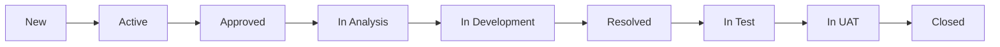
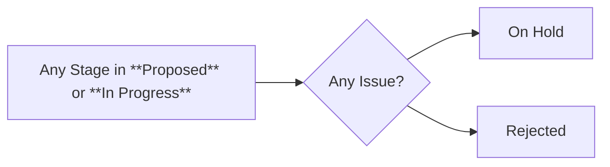
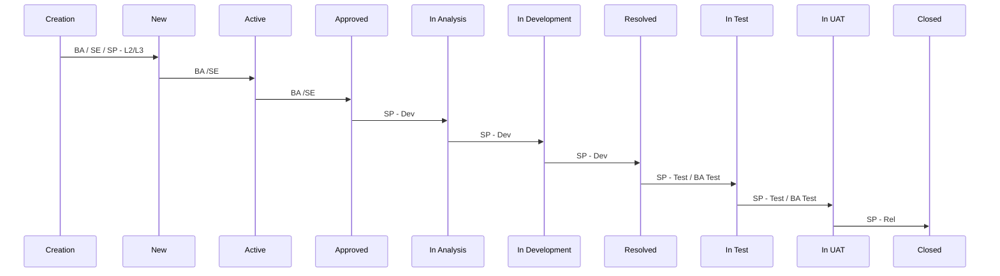

------
# States
- Proposed
  - New
- In Progress
  - Active
  - Approved
  - In Analysis
  - In Development
  - In Test
  - In UAT
  - On Hold
- Resolved
  - Resolved
- Completed
  - Closed
- Removed
  - Rejected

 
 

Please find more details about each state:

|Work item state | Description|
|--------------------------|-----------------------------|
|New |Proposed new requirement. Missing details and confirmation. Assigned to UNHCR. |
|Active| Requirement is confirmed to be needed, might be missing details, acceptance criteria and approval from stakeholders. |
|Approved| Requirement is reviewed and approved by UNHCR team and assigned to Microsoft development team lead. If more questions, Microsoft team lead might assign it back to UNHCR. |
|In Analysis| Developer is analyzing the requirement. The work item is not yet being developed on. |
|In Development | Development is in progress|
|Resolved| Development has been finished and item is ready for Testing. In the scenario when requirement does not need testing, Microsoft dev team will put requirement in "Closed" state once development is finished. |
|In Test| Testing has been started. During this phase, requirement is deployed in Test environment and available for Microsoft testing. Once testing is finished by Microsoft, item is assigned to UNHCR team member for the UAT testing. |
|In UAT| UNHCR has started UAT testing. |
|On Hold| Work item has been put on hold until further notice. |
|Closed| Work item/requirement has been tested and is ready to be moved to PROD.|
|Rejected| Item is no longer relevant and is removed from the list of requirements.|

 
 

**IMPORTANT:** 
To accommodate the current Azure DevOps environment set up and assure our sprint reporting is not impacted, two iterations named **_Testing_** and **_Resolving_** have been created. 
If work item is in "Resolved" or "In Test" or “In UAT" states, it comes out of the main sprint (Sprint 1, Sprint 2, etc.) and are moved to a new iteration. 
When status is changed to **Resolved**, work item is moved to **_Resolving_** iteration by dev team, meaning development is finished and item is ready for Microsoft testing. 
Once testing has started and item is in **In Test** or **In UAT** stages, it is moved to **_Testing_** iteration. 
This approach allows us to assure items do not affect the main sprint task completion.
WE expect UNHCR team to review, tests and close all work items in **_Testing_** and **_Resolving_** sprints. Once UNHCR and Microsoft completes tasks for these work items, they should be put in status **Closed**. Microsoft team will move then to the current sprint. 

 
 
 
 

----
## Required Fields by State

### New
- **Required**: Description, Acceptance Criteria, SNOW Ticket Number, Module, Link to Related Work (Parent / Related Work Items), Reason, Requirement Type, Requirement Complexity, Requirement Stage, Dev Review, ARB Review, In Scope, Triaged
### Approved
- **Required**: Priority
### In Analysis
- **Required**: Effort, Severity
### In Development
- **Required**: Link to Development
### In Test
- **Required**: Link to Test Cases
### In UAT
- **Required**: Link to Test Cases

Mandatory Fields:
- Reason
- Requirement Type
- Requirement Complexity
- Requirement Stage
- In Scope
- Work Around Available
- Work Around Accepted
----

# Sequence
## Main Flow
<pre>

</pre>

## On Hold / Rejected - Flow
<pre>

</pre>
-----
# Responsibility
</pre>

</pre>

## Acronyms
- **SP - L2/L3**: Services Provide Tech at the L2 or L3 level
- **BA**: UNHCR Business Analysis Team
- **BA Test**: UNHCR Business Analysis Test Focal Point
- **SE**: UNHCR Solution Engineering Team
- **SP - Dev**: Services Provider Developer
- **SP - Test**: Services Provider Test Manager Focal Point
- **SP - Rel**: Services Provider Release Manager Focal Point

